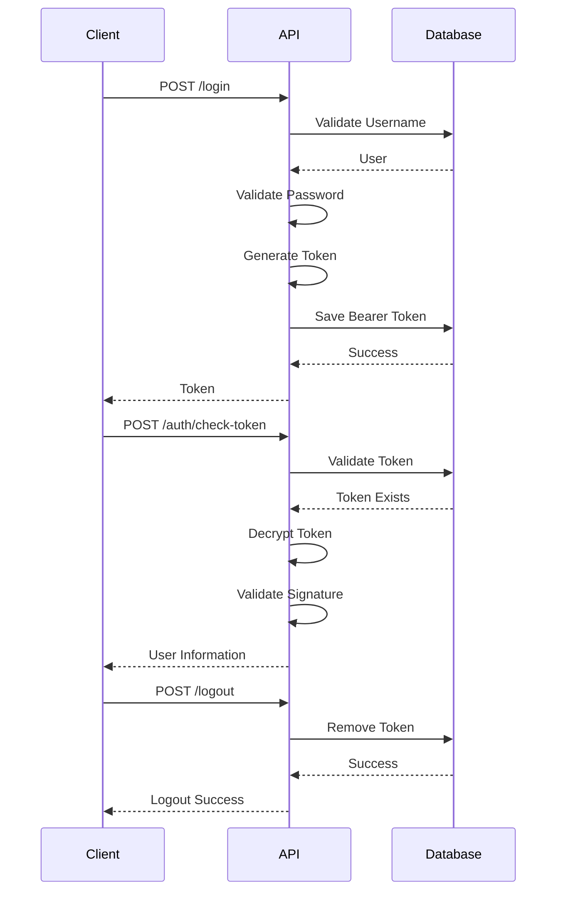

 # 🔐 Secure Authentication Service v3 (JWT Authentication Service v3)

> Secure Authentication Microservice built with **CodeIgniter 3**, **PHP**, and **MySQL** using a custom encrypted bearer token mechanism based on **AES-256-CBC** encryption and **HMAC-SHA256** integrity verification.

- ![PHP]          (https://img.shields.io/badge/PHP-7.x+-777BB4?logo=php)
- ![CodeIgniter]  (https://img.shields.io/badge/CodeIgniter-3-EF4223?logo=codeigniter)
- ![MySQL]        (https://img.shields.io/badge/MySQL-5.7+-4479A1?logo=mysql)
- ![REST API]     (https://img.shields.io/badge/API-REST-green)
- ![AES-256]      (https://img.shields.io/badge/Encryption-AES--256-blue)
- ![HMAC]         (https://img.shields.io/badge/HMAC-SHA256-orange)

---

# Overview

Secure Authentication Service v3 is a lightweight authentication microservice designed for enterprise web applications.

Unlike a standard JWT implementation, this service generates a **custom encrypted bearer token**, stores it inside the database, validates every request against the database, and supports immediate token revocation.

The authentication process combines:

- Username & Password Validation
- AES-256-CBC Encryption
- HMAC SHA-256 Signature Validation
- Token Expiration
- Database Token Verification
- Login Activity Logging
- User Location Logging

---

# Features

- Secure Login
- Custom Encrypted Bearer Token
- Token Expiration
- Token Revocation
- Logout API
- Login Activity Logging
- User Location Detection
- Stateless REST API
- Database Driven Authentication
- Single Active Token per User

---

# Technology Stack

| Technology       | Description            |
|------------------|------------------------|
| PHP              | Backend Language       |
| CodeIgniter 3    | REST Framework         |
| MySQL            | Database               |
| AES-256-CBC      | Token Encryption       |
| HMAC SHA256      | Signature Validation   |
| REST API         | Authentication Service |

---

# System Architecture
```
                +----------------------+
                |      Client App      |
                +----------+-----------+
                           |
                    Login Request
                           |
                           ▼
          +--------------------------------+
          | Authentication Service (CI3)   |
          +---------------+----------------+
                          |
              Validate Username & Password
                          |
                          ▼
                Generate Custom Token
                          |
          AES-256 Encrypt + HMAC Signature
                          |
                          ▼
                Save Token Into Database
                          |
                          ▼
                 Return Bearer Token
```

---

# Authentication Flow

## Step 1 — Login

```
Client
   │
   │ username + password
   ▼
Authentication API
   │
   ├── Validate username
   ├── Validate password
   ├── Build payload
   ├── Encrypt payload
   ├── Generate signature
   ├── Save bearer token
   └── Return bearer token
```

Payload:

```json
{
    "id": "...",
    "name": "...",
    "idjabatan": "...",
    "status": "...",
    "iat": "...",
    "exp": "...",
    "signature": "..."
}
```

---

## Step 2 — Token Validation

```
Client
    │
Bearer Token
    │
    ▼
Authentication API
    │
Lookup Token in Database
    │
Decrypt AES Token
    │
Verify Signature
    │
Verify Expiration
    │
Return User Information
```

---

## Step 3 — Logout

```
Client
    │
Bearer Token
    │
    ▼
Authentication API
    │
Delete Token from Database
    │
Token becomes invalid
```

---

# Sequence Diagram


# Security Design

The authentication token consists of:

- User ID
- Username
- Position ID
- Account Status
- Issued Timestamp
- Expiration Timestamp
- HMAC SHA256 Signature

The payload is encrypted using:

```
AES-256-CBC
```

Before a token is accepted, the system performs multiple validation steps:

- Token exists in database
- Token successfully decrypted
- Signature verification
- Expiration verification
- User validation

If one validation fails, access is rejected immediately.

```

# Authentication Lifecycle

```
LOGIN
   │
   ▼
Generate Token
   │
Encrypt Token
   │
Save Token
   │
Client Receives Token
   │
Authenticated Requests
   │
Check Token
   │
Logout
   │
Delete Token
   │
Token Invalid
```

---

# Installation

```bash
git clone https://github.com/yourusername/jwt-authentication-service-v3.git

cd jwt-authentication-service-v3
```

Configure:

```
application/config/database.php

application/config/config.php

.env
```

Set your encryption key.

```
ENCRYPTION_KEY=YOUR_SECRET_KEY
```

Run the application.

---

# Postman Documentation

Complete API documentation is available through Postman.

https://documenter.getpostman.com/view/3765556/2sBXwyF6of

---

# Future Improvements

- Refresh Token
- Multi Device Session
- OAuth2 Integration
- Rate Limiting
- Redis Token Storage
- Docker Deployment
- API Gateway Support
- Multi-Factor Authentication (MFA)

---

# License
MIT License

---

# Author

**Arif Efendi**
Developed as a secure authentication microservice for enterprise web applications using CodeIgniter 3.
